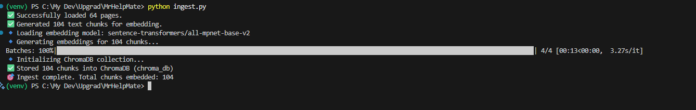
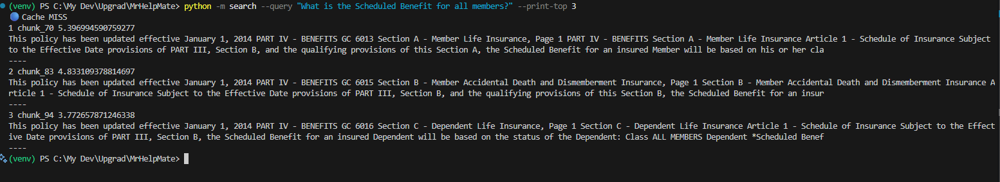
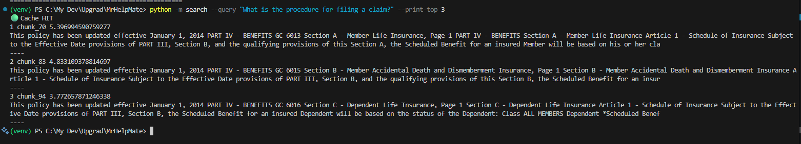
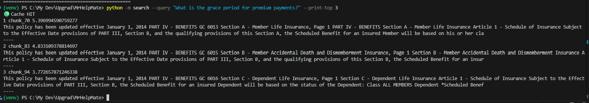
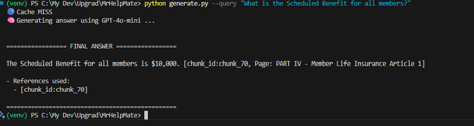
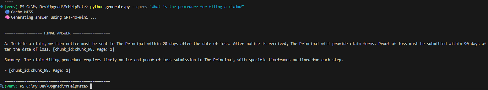
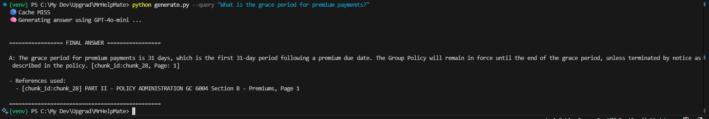

# Mr.HelpMate AI

Mr.HelpMate AI is a Retrieval-Augmented Generation (RAG) based system built to answer queries from a **Group Member Life Insurance Policy** document.  
The system processes the PDF, creates embeddings, retrieves relevant chunks, re-ranks them, and finally generates precise answers using OpenAI GPT models.

---

## 📌 Project Overview
The system is divided into **three layers**:

### 1. Embedding Layer
- PDF loaded and cleaned using **LangChain PyPDFLoader**.
- Text split into 400-token chunks with 80 overlap using `RecursiveCharacterTextSplitter`.
- Embeddings generated with **SentenceTransformers (all-mpnet-base-v2)**.
- Stored in **ChromaDB** persistent vector store.

### 2. Search Layer
- Queries are embedded and searched against ChromaDB.
- A **cache** mechanism stores repeated queries locally.
- Retrieved chunks are **re-ranked** using a HuggingFace cross-encoder model for better relevance.

### 3. Generation Layer
- Top re-ranked chunks are injected into a structured **prompt**.
- The final answer is generated using **OpenAI GPT-4o-mini** (or GPT-4o).
- Citations are included with chunk IDs and page references.

---

## ⚙️ Installation

1. Clone the project:
```bash
git clone https://github.com/nigamreetesh84/MrHelpMate.git
cd MrHelpMate
```

2. Create virtual environment & install requirements:
```bash
python -m venv venv
source venv/Scripts/activate   # On Windows PowerShell
pip install -r requirements.txt
```

3. Place your insurance PDF in the `data/` folder. Example:
```
data/Principal-Sample-Life-Insurance-Policy.pdf
```

4. Set your **OpenAI API Key**:
```bash
setx OPENAI_API_KEY "sk-xxxxxxxxxxxxxxxxxxxx"
```

---

## 🚀 Usage

### Step 1: Ingest the PDF
```bash
python ingest.py
```
✅ Loads 64 pages  
✅ Generates 104 chunks  
✅ Stores embeddings into ChromaDB  

**Screenshot:**  


---

### Step 2: Search Layer (Retrieve Top 3 Chunks)
Run with a query:
```bash
python -m search --query "What is the Scheduled Benefit for all members?" --print-top 3
```
**Screenshot:**  


Repeat for two more queries:
```bash
python -m search --query "What is the procedure for filing a claim?" --print-top 3
python -m search --query "What is the grace period for premium payments?" --print-top 3
```
**Screenshots:**  
-   
-   

---

### Step 3: Generation Layer (Final Answers)
Run with a query:
```bash
python generate.py --query "What is the Scheduled Benefit for all members?"
```
**Screenshot:**  


Repeat for two more queries:
```bash
python generate.py --query "What is the procedure for filing a claim?"
python generate.py --query "What is the grace period for premium payments?"
```
**Screenshots:**  
-   
-   


---

## 📂 Files in Repo

- `ingest.py` → Load, clean, chunk, embed, and store in ChromaDB  
- `search.py` → Retrieve and re-rank top chunks  
- `generate.py` → Generate final answers with GPT + citations  
- `cache.py` → Simple shelve-based cache for queries  
- `config.py` → Configurable chunk size, overlap, and embedding model  
- `requirements.txt` → Dependencies list  
- `README.md` → Project documentation (this file)  

---

## ✅ Conclusion
Mr.HelpMate AI successfully answers user queries from the insurance policy using a **RAG pipeline** with embeddings, vector search, reranking, and generative LLMs.  
This demonstrates **practical AI retrieval systems** with caching, chunking strategy, and explainable answers with citations.

---

## 📧 Contact

Created by [Reetesh Nigam](https://github.com/nigamreetesh84)
